# بسم الله الرحمن الرحيم

## Network Protocols and Devices

### Chapter Objectives
- Define the meaning of Network Protocol and its benefits
- Understand Basics of TCP/IP
- Understand Basics of Addressing
- Understand Basics of IEEE LAN Standards
- Compare between different devices used in networking
- Understand differences between - Collision Domain and Broadcast Domain
- Understand Fragmentation

### Network Communication Protocols

### The Need for Protocols
- Protocols are needed for computer networks to communicate efficiently
- Network protocols are set of rules that enable data to flow from one NIC to another
- Protocols control the messages origination, the messages end, and the messages quantity in the network.

### Major Networking Protocols
- NetBIOS
- NetBEUI
- IPX/SPX
- AppleTalk
- TCP/IP

### NetBIOS
- Network Basic Input / Output System
- Common Protocol that allows Applications in LAN to communicate
Originally developed by IBM (for LAN Manager)
- Obtained by Microsoft for Windows NT and LAN Manager
- Non-routable

### NetBEUI
- NetBIOS Extended User Interface. 
- This is an enhanced version of the NetBIOS protocol used by network operating systems (NOS), such as Microsoft's Windows NT.
- Non-routable 

### IPX/SPX
- Internet Packet Exchange / Sequenced Packet Exchange
- A communications protocol devised by Novell for Novell NetWare.
- IPX/SPX packets can be routed from one network to another
Used Mainly for SAN Storage

### NetWare
- Computer Network Operating System
- Developed by Novell, Inc.
- Initially used cooperative multitasking to run various services with network protocols
- Ran a proprietary star network topology

### SAN Storage
- Storage Area Network
- High Speed subnetwork of shared Storage Devices
- Storage Device: machine that contains nothing but a disk or disks for storing data

### IPX/SPX Advantages and Disadvantages
- Advantages
  - Ease of setup.
  - Support for routing between networks.
  - Speeds greater than TCP/IP for NT.

- Disadvantages
  - Slower than NetBEUI.
  - IPX/SPX is not a vendor neutral

### AppleTalk
- Set of LAN communication protocols
- Originally created for Apple computers
- Support up to 32 devices
- Data can be exchanged at a speed of 230.4 kilobits per second (Kbps)

### TCP/IP
- Transmission Control Protocol / Internet Protocol
- TCP/IP is open standard protocol
  - Not tied to one vendor
- TCP / IP is the Internet stack of Protocols
- It is the default protocol
  - Every Operating System

### Why TCP/IP?
- Standard
- Routable 
- Cross Platform

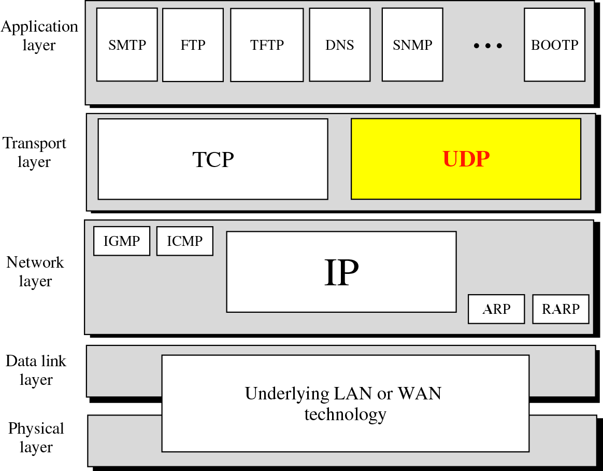

### TCP/IP Protocol Architecture
- Application Layer
  - Communication between processes or applications
- Transport Layer (TCP/UDP)
  - End to end transfer of data
  - May include reliability mechanism (TCP)
  - Hides detail of underlying network
- Internet Layer (IP)
  - Routing of data
- Network Access Layer

### UDP
- User Datagram Protocol
- Transport layer protocol
- Process to process communication
  - Use port numbers
- Connectionless 
- Unreliable
- Perform very limited error checking
- Very simple using a minimum of overhead

### TCP
- Transmission Control Protocol
- Transport layer protocol
- Process to process communication 
- Use port numbers
- Reliable ( Use acknowledgements )
- Connection oriented (Three way handshake)
- Flow control (window size)

### Port Numbers
- Well Known ports
  - Range from 0 to 1,023 
- Registered ports
  - Range from 1,024 to 49,151 not assigned or controlled by ICANN but can be registered at ICANN to avoid duplication
- Dynamic ports
  - Range from 49,152 to 65,535 are neither controlled nor registered

### Socket Address

### Addressing in TCP/IP

### Relationship of Layers and Addresses in TCP/IP

### Physical Addresses
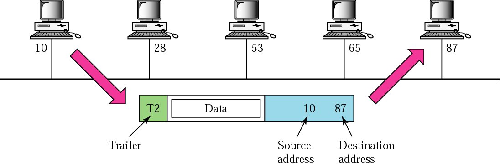

### IP Addresses
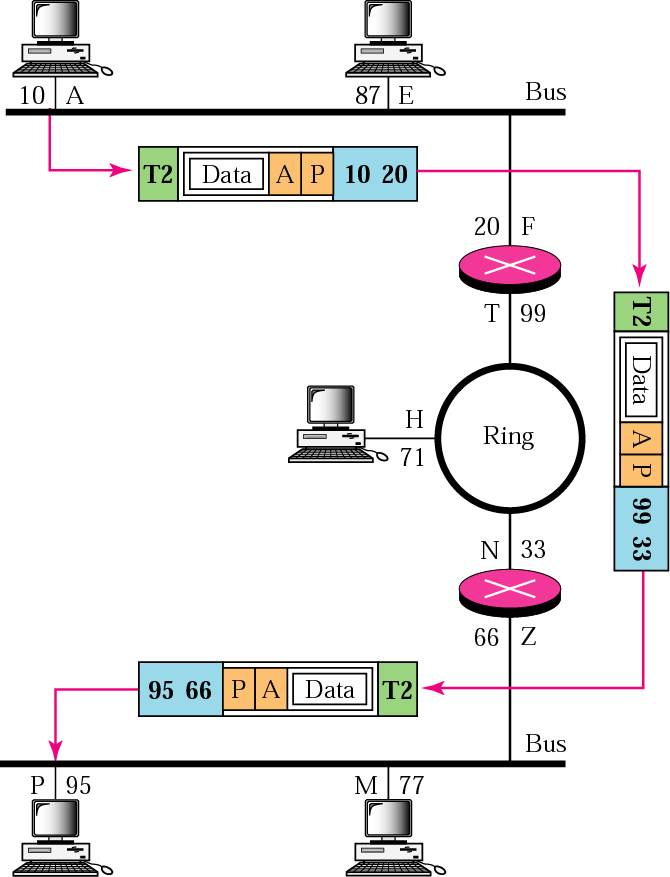

### Port Addresses
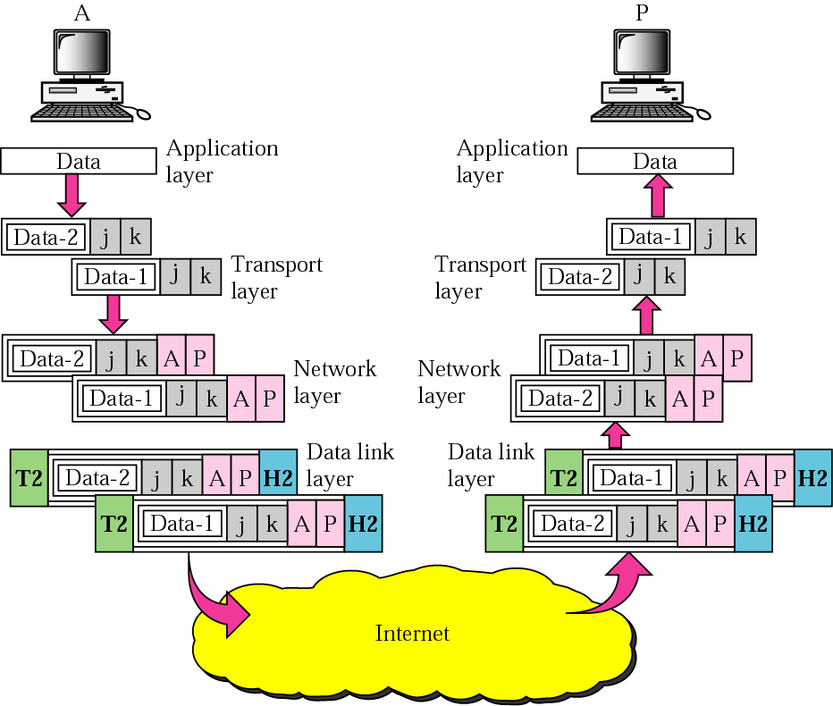

### IP v.4
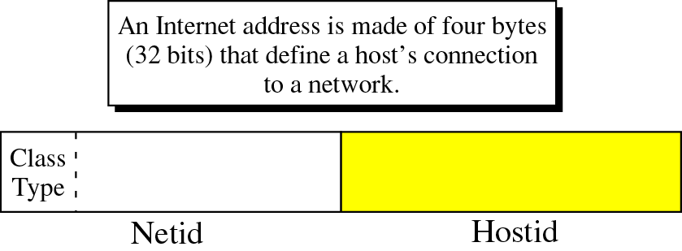

### IP Address Classes
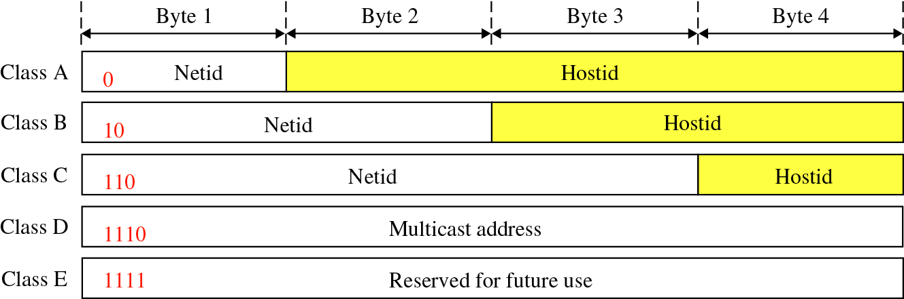
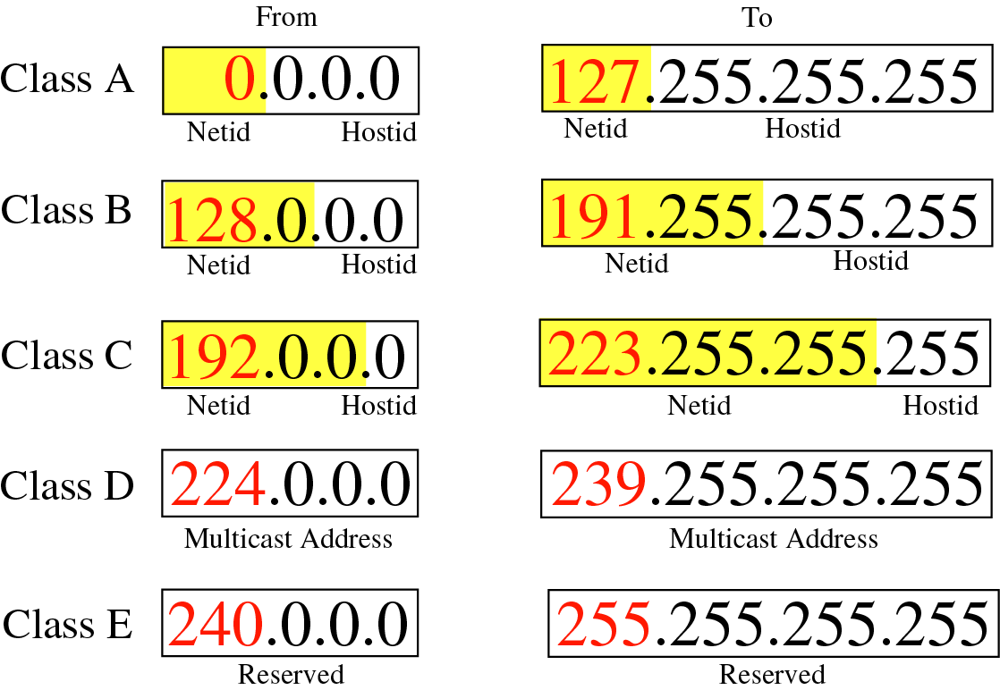

### Special IP Addresses
- Network address
- Limited broadcast address
- Direct Broadcast address
- Loopback address

### Network Address
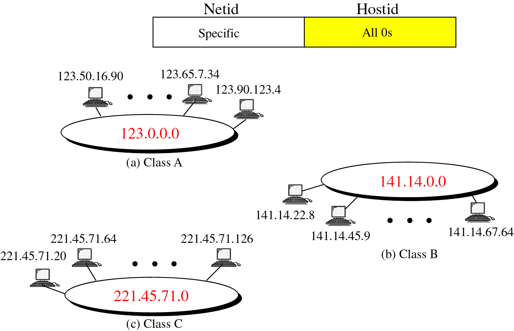

### Limited Broadcast Address
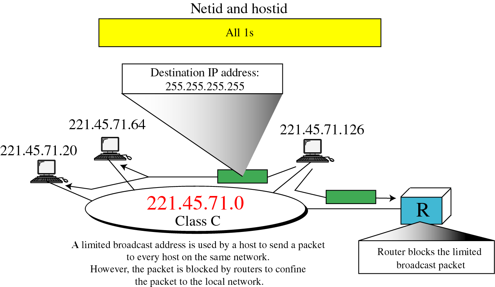

### Direct Broadcast Address
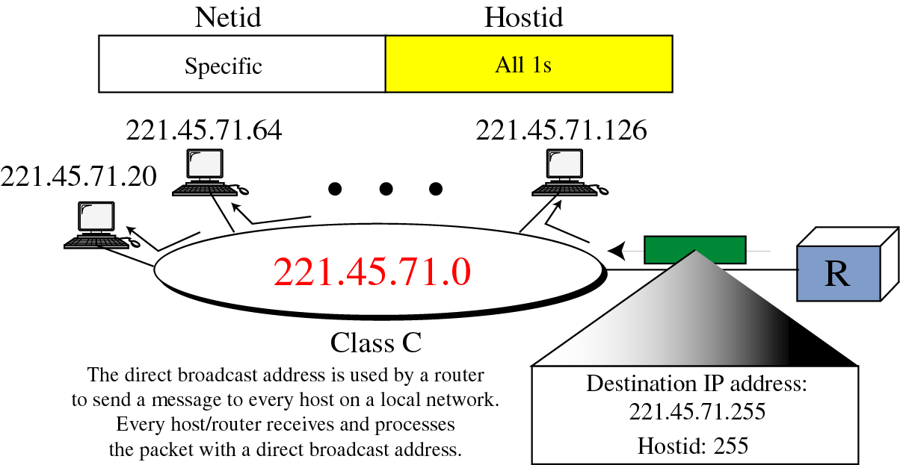

### Loopback Address
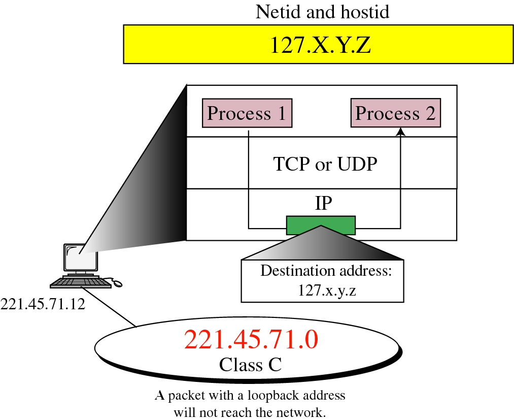

### Special IP Addresses
Private IP
- The Internet Assigned Numbers Authority (IANA) has reserved the following three blocks of the IP address space for private internets (local networks):
  - 10.0.0.0 - 10.255.255.255           >> Class A
  - 172.16.0.0 - 172.31.255.255       >> Class B
  - 192.168.0.0 - 192.168.255.255   >> Class C

### NAT
- Network Address Translation
- The process of modifying IP address information in IP packet headers while in transit
- Simplest type: one-to-one translation of IP addresses
- Types:
  - Static
  - Dynamic

### Subnetting
- In subnetting, a network is divided into smaller subnets with each subnet having its own subnet address.
- Benefits of subnetting:
  - Reduced network traffic 
  - Simplified management

### Network Before Subnetting
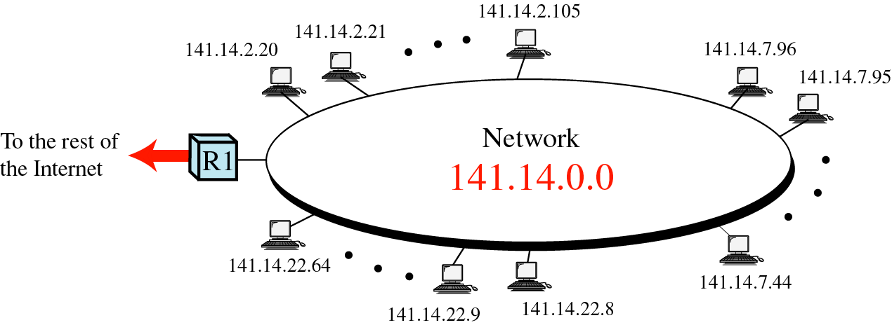

### Network After Subnetting
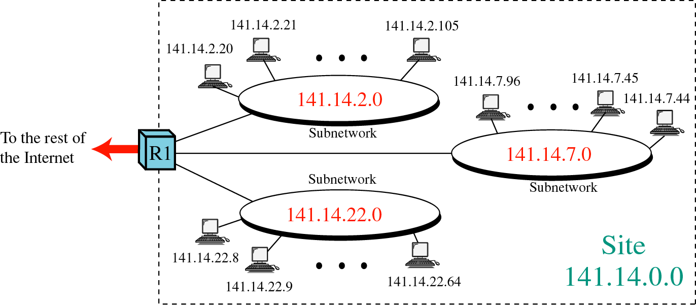

### Network Layer

### Delivery of IP Packets
- Direct delivery
- Indirect delivery

### Direct Delivery
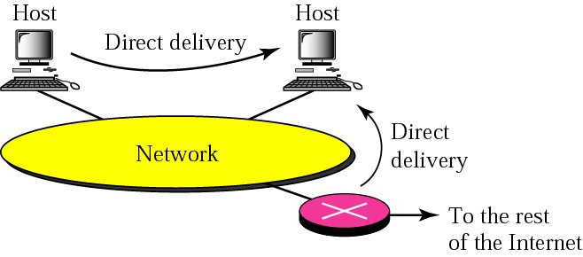

### Indirect Delivery
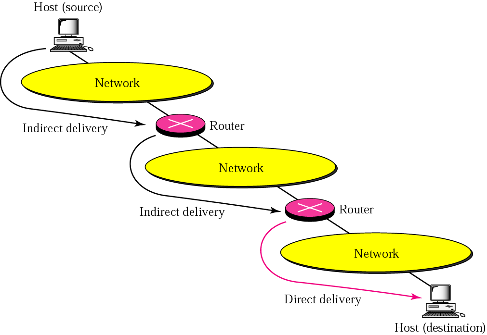

### ARP
- Address Resolution Protocol

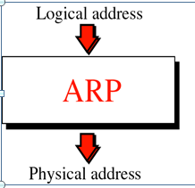

### ARP Operation
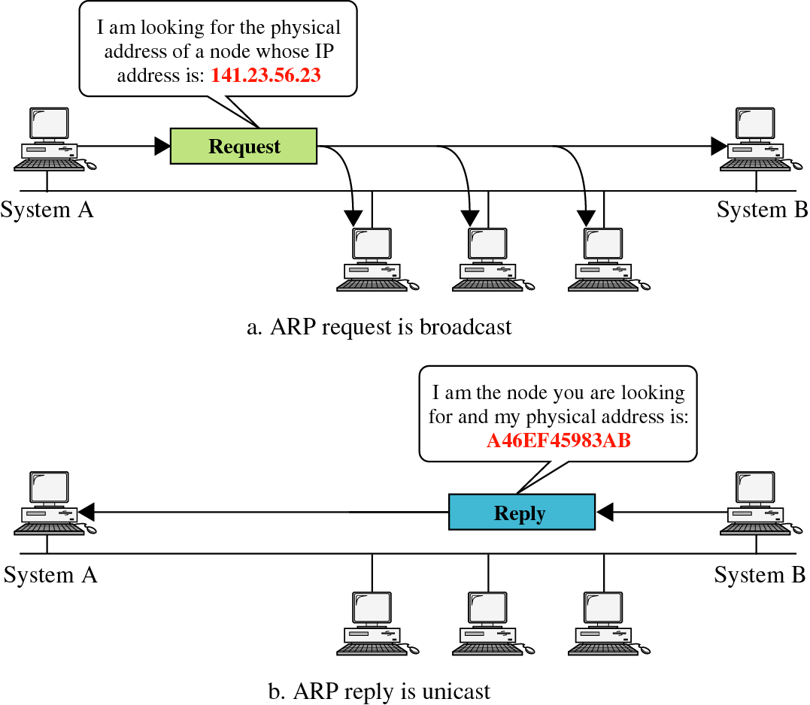

### How to Assign IP Address to Device?
- Manually
- Automatic
- APIPA

### APIPA
- Automatic Private IP Addressing
- APIPA feature, when installed – will automatically assign an IP to a computer if it is:
  - Configured to obtain IP address automatically from DHCP
  - And there is no DHCP server present or the DHCP server is not available
- IANA (Internet Assigned Numbers Authority) has reserved private IP addresses in the range of 169.254.0.0 – 169.254.355.355

### Internet Services
- The World Wide Web: HTTP
- File Transfer: FTP
- Electronic Mail service: IMAP, POP3, SMTP
- Naming Service: DNS
- Telnet Service

### Web Server and Clients
- Browser as web client

### FTP Server and Clients
- FTP Client
  - Browser as FTP Client
  - Using Built-in FTP Client
  - Third party programs "cute FTP"

### Mail Server and Clients

### Mail Server
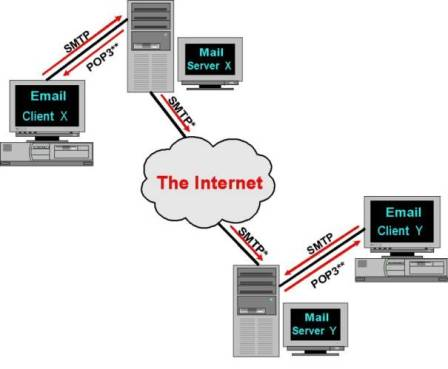

### Mail Protocols
- SMTP
  - It is the common language used by the majority of Mail Servers to send messages back and forth to other Mail Servers or Email Clients
- POP3 “Post Office Protocol version 3”
  - In order to collect email messages from the Mail Server, the Email Client contacts the Mail Server.
  - Download msgs on the H/D
  - You can work Offline
  - Keep the user’s quota on the server
- IMAP4 “Internet Message Access Protocol version 4”
  - Retrieve only msgs header

### Mail Clients
- Web based 
- Non web based

### Telnet Services
- Telnet is a user command and an underlying TCP/IP protocol for accessing remote computers. 
- Through Telnet, an administrator can access someone else's computer remotely 
- Telnet Client
  - Built-in client
  - Third Party programs

### Naming Services

- URL
  - Universal Resource Locator
  - Protocol: HTTP or FTP

- DNS
  - At the beginning they use Hosts file
  - It maps the IP addresses to host names
  - It is found at “/etc/hosts”
  - Then they make DNS Server to centralize the Domain Name Servers.
  - Servers are used to convert the addresses we see and read into IP addresses and vice-versa
  - nslookup
    - nslookup is the name of a program that lets you to enter a host name and find out the corresponding IP address

### Client / Server Examples

| Client  | Protocol | Server | Port No. |
| ------- | -------- | ------ | -------- |
| Browser |   HTTP   |  web   |    80    |
| Browser |   FTP    |  FTP   |    21    |
| Browser |   HTTP - SMTP - POP3 - IMAP4 | Mail | 80 - 110 - 143 - 25|
| Telnet  |   Telnet | Telnet |    23    |

