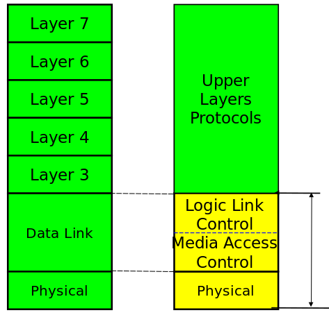
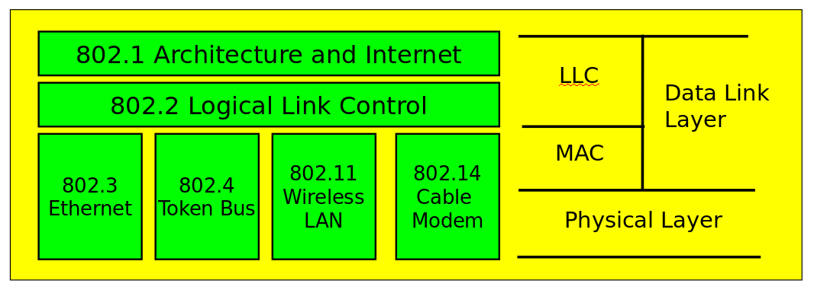
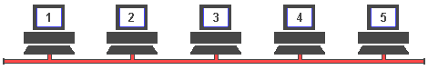
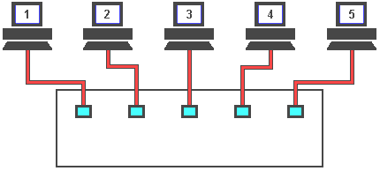
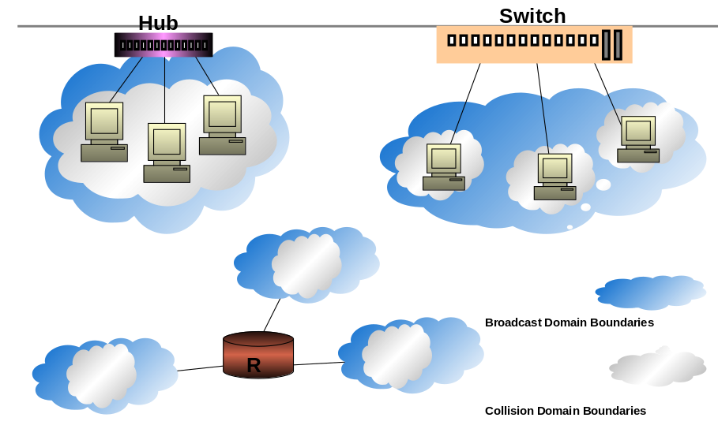
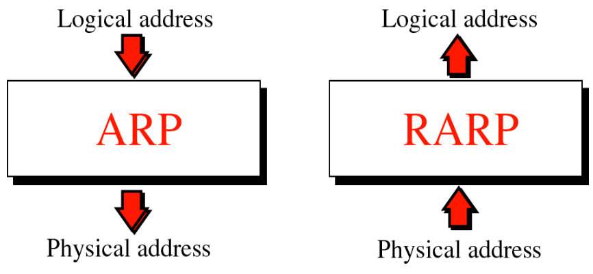

# بسم الله الرحمن الرحيم

## IEEE LAN Standard

### IEEE LAN Standards
- IEEE: Institute of Electrical and Electronic Engineers
- IEEE create standards for computer and communications
- IEEE 802 series of standards for LAN technologies
- IEEE defined several access methods
  - CSMA/CD
  - Token passing

### Protocol Architecture
- Lower layers of OSI model
- IEEE 802 reference model
- LAN layered protocol architecture
  - Physical (topologies)
  - Media access control
  - Logical Link Control
- All IEEE 802.x have the same LLC sublayer
- MAC sublayer has very close relationship with the characteristics of physical medium and the topology of network

### IEEE 802 vs. OSI

### Ethernet Technologies
- The term Ethernet refers to the family of local-area network (LAN) products covered by the IEEE 802.3 standard that defines what is commonly known as the CSMA/CD protocol. 
- Data rates defined for operation over optical fiber and twisted-pair cables: 
  - 10 Mbps—10Base-T Ethernet 
  - 100 Mbps—Fast Ethernet 
  - 1000 Mbps—Gigabit Ethernet 
  - 10000Mbps—10Gigabit Ethernet 

### Half-Duplex Transmission - CSMA/CD Access Method
- The CSMA/CD protocol was originally developed as a means by which two or more stations could share a common media
- It is used when the protocol does not require central arbitration, access tokens, or assigned time slots to indicate when a station will be allowed to transmit.
- Each Ethernet MAC determines for itself when it will be allowed to send a frame

### CSMA/CD Access Rules
- Carrier sense
  - Each station continuously listens for traffic on the medium to determine when gaps between frame transmissions occur.
- Multiple access
  - Stations may begin transmitting any time they detect that the network is quiet (there is no traffic).
- Collision detect
  - This means that if any collision occurs, it will be detected immediately

### Basic Ethernet Bus

- Machine 2 wants to send a message to machine 4
- First it 'listens' to make sure no one else is using the network.
- If it is all clear it starts to transmit its data on to the network 
- The signal moves down the cable and is received by every machine on the network but because it is only addressed to number 4, the other machines ignore it.
- Machine 4 then sends a message back to number 1 acknowledging receipt of the data 

### Collisions

- machine 2 and machine 5 both trying to transmit simultaneously.
- The resulting collision destroys both signals 
- Both machines then wait for a random period of time before re-trying

### Full-Duplex Transmission
- Full-duplex operation is an optional MAC capability that allows simultaneous two-way transmission over point-to-point links.
- Full duplex transmission is functionally much simpler than half-duplex transmission because it involves no media contention, no collisions, and no need to schedule retransmissions.

### Full-Duplex Transmission

- To overcome the problem of collisions and other effects on network speed, a switch is used.
- With a switch, machines can transmit simultaneously

### Devices Used in Networking
- Networking Devices
  - Repeater
  - Hub 
  - Bridge
  - Switch
- Internetworking Devices
  - Router

- Repeater
  - A repeater is an electronic device that receives a weak or low-level signal and retransmits it at a higher level or higher power, so that the signal can cover longer distances without degradation.
  - Can connect computers that are far from each other 
  - Operate at the physical layer of OSI/RM

- Hubs
  - Operate at the physical layer of OSI/RM
  - Hub retransmits incoming signal to all outgoing lines
  - Only one station can transmit at a time
  - With a 10Mbps LAN, total capacity is 10Mbps

- Bridges
  - A network bridge connects multiple network segments at the Data Link Layer
  - Network bridges filter frames to determine whether a specific frame belongs on a local segment or another LAN segment
  - Use hardware address to determine which segment will receive the frame
  - Operate at the layer 2 of OSI/RM
  - Reduce network traffic 
  - Connect network segments with same or different DLL protocol

- Switches
  - A device that connects PCs in star configured networks
  - Faster than hubs and bridges
  - Benefits
    - Simple installation
    - Higher speed
    - More server bandwidth
  - Can operate at several layers of OSI/RM
  - Each device has dedicated capacity equal to the LAN capacity

- Layer 2 switch
  - LAN switch
  - Forwards traffic based on the MAC address

- Layer 3 switch
  - Routing switch
  - Forwards traffic based on IP Address
  - Used for Inter-VLAN routing
  - Don’t have WAN connectivity

### Bridging vs. LAN Switching
- Bridges are software based, while switches are hardware based because they use ASIC chips to help make filtering decisions.
- Switches have a higher number of ports than most bridges.
- Both bridges and switches forward layer 2 broadcasts.
- Bridges and switches learn MAC addresses by examining the source address of each frame received.
- Both bridges and switches make forwarding decisions based on layer 2 addresses

- Routers
  - A device that connects any number of LANs.
  - Used to redirect packets between networks
  - Use headers and a forwarding table to determine where packets go
  - Use network layer address ( IP Address)
  - Operate at the network layer of OSI/RM

### Collision Domain vs. Broadcast Domain
- Collision Domain
  - It consists of all devices (NICs) that can see or be involved in a collision
- Broadcast Domain
  - It consists of all devices that can see the broadcast
- Generally, layer 2 devices border a collision domain, while layer 3 devices border a broadcast domain

### ARP vs. RARP
![ARP vs. RARP]
- ARP : Address Resolution Protocol
- RARP : Reverse Address Resolution Protocol

### Fragmentation
Some physical networks are not able to encapsulate a datagram of 65,535 bytes in their frames
- The datagram must be fragmented to pass through this network
- Each fragment has its own header with most of fields repeated, but some changed
- A fragment datagram may be fragmented if it encounters network with smaller MTU
- Each fragment becomes an independent datagram
- Fragments of same datagram may follow any path 

# تم بحمد الله

