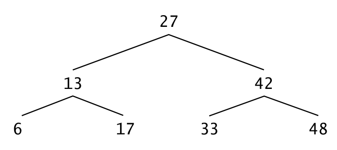
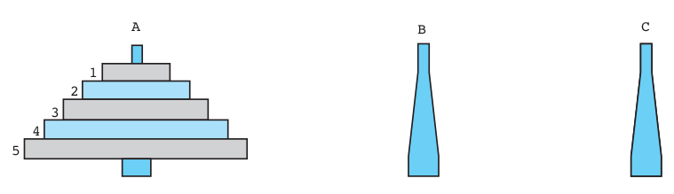

# بسم الله الرحمن الرحيم

## Linear vs. Nonlinear Data Structures
- Linked lists, stacks and queues are linear data structures. 
- A tree is a nonlinear, two-dimensional data structure with special properties

### Binary Search Trees
- Functions inOrder, preOrder, and postOrder each receive a tree (i.e., the pointer to the root node of the tree) and traverse the tree.

- The steps for an inOrder traversal are:
  - 1. Traverse the left subtree inOrder
  - 2. Process the value in the node
  - 3. Traverse the right subtree inOrder

- The inOrder traversal of a binary search tree prints the node values in ascending order
- The process of creating a binary search tree actually sorts the data—and thus this process is called the binary tree sort

- The steps for a preOrder traversal are:
  - 1. Process the value in the node
  - 2. Traverse the left subtree preOrder
  - 3. Traverse the right subtree preOrder

- The value in each node is processed as the node is visited
- After the value in a given node is processed, the values in the left subtree are processed, then those in the right subtree are processed

- The steps for a postOrder traversal are
  - 1. Traverse the left subtree postOrder .
  - 2. Traverse the right subtree postOrder .
  - 3. Process the value in the node.

- The value in each node is not printed until the values of its children are printed

- Example

  - Inorder: 6 13 17 27 33 42 48
  - Preorder: 27 13 6 17 42 33 48
  - Postorder: 6 17 13 33 48 42 27

- bst.c 
  - creates a binary search tree
  - traverses it three ways inorder, preorder and postorder
  - The program generates 10 random numbers and inserts each in the tree, except that duplicate values are discarded

## Merge Sort

### Sort Taxonomies
- Inplace Sort
  - inplace
  - outplace
- Ordered Sort
  - Ordered
  - Unordered

- merge_sort.c

## Towers of Hanoi

### PROBLEM
- Move n disks from peg A to peg C using peg B as needed. The following conditions apply:
  - 1. Only one disk at a time may be moved, and this disk must be the top disk on a peg.
  - 2. A larger disk can never be placed on top of a smaller disk.

### Algorithm
- 1. if n is 1 then
  - 2. Move disk 1 from the from peg to the to peg
- else
  - 3. Move n - 1 disks from the from peg to the auxiliary peg using the to peg.
  - 4. Move disk n from the from peg to the to peg.
  - 5. Move n - 1 disks from the auxiliary peg to the to peg using the from peg.

- Towers of Hanoi - Video
  - https://www.youtube.com/watch?v=rVPuzFYlfYE
  - Special Thanks to: Prof. Eric Grimson - MIT
  - Course: https://www.edx.org/course/mit/6-00x/introduction-computer-s%C2%ADcience/586
  - Note: This is the first online course I have attended - Back at http://videolectures.net/mit600f08_intro_computer_science_programming/
  
- towers_of_hanoi.c