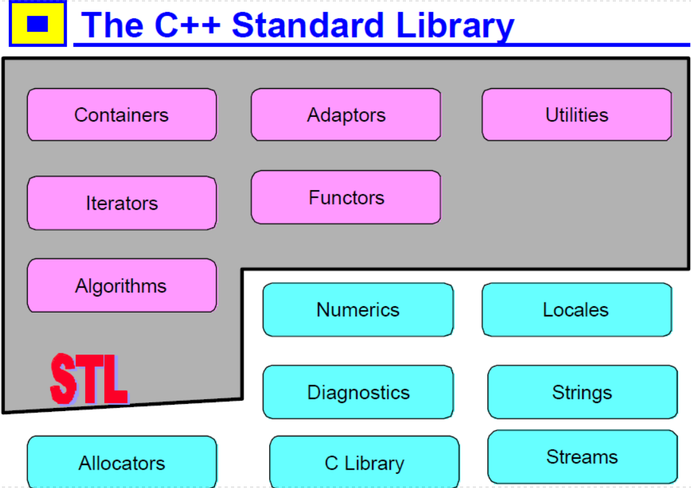
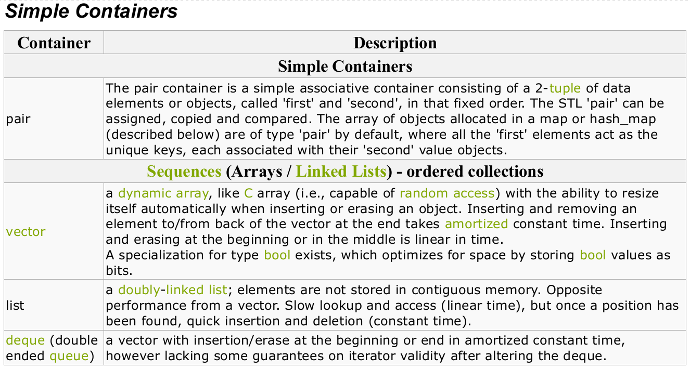
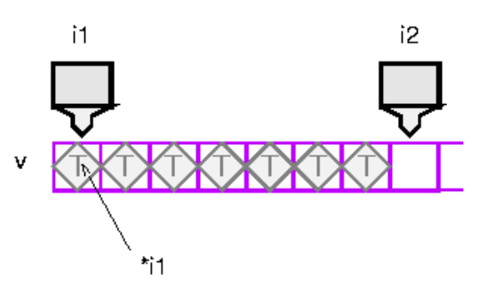

# بسم الله الرحمن الرحيم

## Move to C++

### Source
- 6.096 Introduction to C++, Massachusetts Institute of Technology, January 24th, 2011, John Marrero, Lecture 9 Notes: Advanced Topics I
- The C++ Standard Library, 2nd Edition, A Tutorial and Reference, Nicolai M. Jusuttis
- C++ Standard Template Library, Lecture Notes, cs.brown.edu
- <a href="https://www.topcoder.com/community/data-science/data-science-tutorials/power-up-c-with-the-standard-template-library-part-2/#algorithms"> Power up C++ with the Standard Template Library: Part 2 </a>, by <a href="https://www.topcoder.com/members/DmitryKorolev/"> Dmitry Korolev </a>

### C++ Versions
- C++11

#### Templates ?!
- Functions can take arguments of specific types and have a specific return
type.
- Templates, which allow us to work with generic types.
- Through templates, rather than repeating function code for each new type we wish to accommodate, we can create functions that are capable of using the same code for different types.
  - generics_01.cpp
  - generics_02.cpp
- Templates can also specify more than one type parameter.
  - generics_03.cpp
- Class Templates
  - generics_04.cpp

#### Pair
- The class pair treats two values as a single unit.
- This class is used in several places within the C++ standard library.
- In particular, the container classes map, multimap, unordered_map, and unordered_multimap use pairs to manage their elements, which are key/value pairs.
- The structure pair is defined in <utility>
- For full list of operations, Check Table 5.1 in the Reference Book
- Main Operations
  - create
  - copy/assign/swap
  - compare
  - definitions of first_type and second_type

```c++
#include <utility>

// Default constructor, creates a pair of values of types T1 and T2, initialized with their default constructors
pair<T1,T2> p;

// Creates a pair of values of types T1 and T2, initialized with val1 and val2
pair<T1, T2> p(val1, val2);

// Copy constructor; creates p as copy of p2
pair<T1, T2> p(p2);

// Assigns the values of p2 to p (implicit type conversions are possible since C++11)
p = p2;

// yields the first value inside the pair (direct member access)
p.first;

// yields the second value inside the pair (direct member access)
p.second;

//Equivalent to p.first (since C++11)
get<0>(p);

//Equivalent to p.second (since C++11)
get<1>(p);

// Returns whether p1 is equal to p2 (Equivalent to p1.first==p2.first && p1.second==p2.second)
p1 == p2;

// Returns whether p1 is not equal to p2 (!(p1==p2))
p1 != p2;

// Returns whether p1 is less than p2 (compares first or if equal second of both values)
p1 < p2;

// Returns whether p1 is greater than p2 (p2<p1)
p1 > p2;

// Returns whether p1 is less than or equal to p2 (!(p2<p1))
p1 <= p2;

// Returns whether p2 is greater than or equal to p1 (!(p1<p2))
p1 >= p2;

// Swaps the data of p1 and p2 (since C++11)
p1.swap(p2);

// Same (as global function) (since C++11)
swap(p1, p2);

// Returns a pair with types and values of val1 and val2
make_pair(val1, val2);
```

### C++ Standard Library
 </img>

- <b> Containers </b> are objects that contain other objects, e.g., vector, set, map.
- <b> Iterators </b> represent locations in a container. Each container has its own iterator type.
- <b> Algorithms </b> are operations on containers, e.g., find, sort, random_shuffle.
- <b> Functors </b> are operations on objects, e.g., less, plus.
- <b> Adaptors </b> are objects that change an interface, e.g., not1. (That's a one at the end, not an ell; there
is also a not2.)
- <b> Utilities </b> are components such as pairs, operations like comparison, etc. In the ANSI standard,
allocators are included in the utilities section.
- <b> Diagnostics </b> are provided to deal with exceptions.
- <b> Locales </b> facilitate internationalization.
- <b> Numerics </b> are container types that are optimized for speed, less general than containers, e.g., valarray, complex.
- <b> Strings </b> replace C’s character arrays.
- <b> Streams </b> are used for input and output.
- <b> Allocators </b> customize memory allocation, e.g., malloc_alloc.

### C++ STL
- Part of the C++ Standard Library
- Standard Template Library (STL) contains many useful container classes and algorithms.
- These various parts of the library are written using templates and so are generic in type.
- The containers found in the STL are lists,maps, queues, sets, stacks, and vectors.
- The algorithms include sequence operations, sorts, searches, merges, heap operations, and min/max operations.

### Containers
 </img>

- STL provides a number of container types, representing objects that contain other objects.
- One of these containers is a class called vector

#### Vector
- behaves like an array, but can
grow itself as necessary.
- One of the operations on vector is push_back, which pushes an element onto the end of the vector (growing it by one).
- A vector contains a block of contiguous initialized elements -- if element index k has been initialized, then so have all the ones with indices less than k.
- A vector can be presized, supplying the size at construction, and you can ask a vector how many elements it has with size. This is the logical number of elements -- the number of elements up to the highest-indexed one you have used.
- There is also a notion of capacity -- the number of elements the vector can hold before reallocating.

 </img>

### Illustrate Iterators First, then come back Here

 </img>

 </img>

 </img>

 </img>
#### Sets
- sets_01.cpp
  - In this example, we create an integer set and insert several integers into it.
  - We then create an <b>iterator</b> corresponding to the set at lines 14 and 15.
  - An iterator is basically a pointer that provides a view of the set. (Most of the other containers also provide iterators.)
  - By using this iterator, we display all the elements in the set and print out iset contains: 1 3 5 8 9.
  - Note that the <b> set automatically sorts its own items </b>.
  - Finally, we ask the user for an integer, search for that integer in the set, and display the result.

### Iterators
- Iterators provide a way of specifying a position in a container.
- An iterator can be incremented or dereferenced, and two iterators can be compared.
- There is a special iterator value called "past-the-end".
- You can ask a vector for an iterator that points to the first element with the message begin.
- You can get a past-the-end iterator with the message end. The code
```C++
vector<int> v;
// add some integers to v
vector::iterator i1 = v.begin();
vector::iterator i2 = v.end();
```
- will create two iterators like this
 </img>

- Operations like sort take two iterators to specify the source range.
- To get the source elements, they increment and dereference the first iterator until it is
equal to the second iterator.
- Note that this is a semi-open range: it includes the start but not the end.
- Two vector iterators compare equal if they refer to the same element of the same
vector.

- vectors_01.cpp

#### Rotate
- Self Study
- rotate.cpp

## Real Algorithms

### Depth-First Search
- Pre-requisite: community.topcoder.com/tc?module=Static&d1=tutorials&d2=graphsDataStrucs2
  - DFS is well geared towards problems where we want to find any solution to the problem (not necessarily the shortest path), or to visit all of the nodes in the graph.
  - The flood-fill operation will be familiar to anyone who has used a graphic painting application. The concept is to fill a bounded region with a single color, without leaking outside the boundaries.
  - This concept maps extremely well to a DFS. The basic concept is to visit a node, then push all of the nodes to be visited onto the stack. To find the next node to visit we simply pop a node of the stack, and then push all the nodes connected to that one onto the stack as well and we continue doing this until all nodes are visited.
  - It is a key property of the DFS that we not visit the same node more than once, otherwise it is quite possible that we will recurse infinitely. We do this by marking the node as we visit it.

- STL to implement DFS
  - At first, imagine we have an undirected graph.
  - The simplest way to store a graph in STL is to use the lists of vertices adjacent to each vertex.
  - This leads to the vector< vector<int> > W structure, where W[i] is a list of vertices adjacent to i.
  - Let’s verify our graph is connected via DFS:
