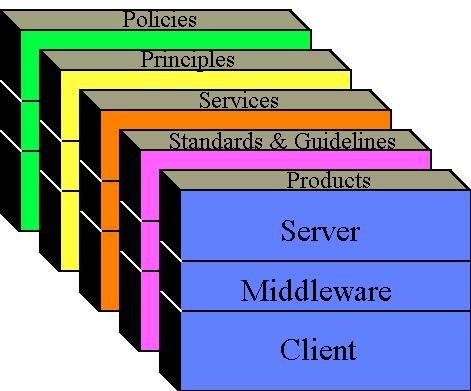

# بسم الله الرحمن الرحيم

## Information Architecture
- Information (Information technology) architecture
- the process of development of 
  - methodical information technology specifications
  - models and guidelines
  - using a variety of Information Technology notations, for example UML
  - within a coherent Information Technology architecture framework
  - following formal and informal Information Technology solution, enterprise, and infrastructure architecture processes. 

- Best practice Information Technology architecture encourages the use of open technology standards and global technology interoperability. 
- Information Technology Architecture can also be called a high-level map or plan of the information assets in an organization, including the physical design of the building that holds the hardware.
- IBM was an early developer of formal solution and infrastructure architecture methodologies for information technology

### IT ARCHITECTURE: STANDARDIZING TECHNOLOGY
- Standardization of technology is a common part of IT architecture projects
- A standardized technology reduces complexity and offers benefits such as 
  - cost savings through economy of scale, 
  - ease of integration, 
  - improved efficiency, 
  - greater support options, 
  - and simplification of future control. 
  
- Some common targets for standardization include
  - User workstation environments: This includes desktop hardware, operating system, and user productivity suites.
  - Software development: Consider standardizing not only programming languages, but also software development practices.
  - Database management systems: Try to standardize on a single database platform, such as Oracle, Microsoft SQL, mySQL, or PostgreSQL.

### IT ARCHITECTURE: CONSOLIDATING AND CENTRALIZING TECHNOLOGY RESOURCES

- A good IT architecture plan improves efficiencies. 
- When your IT architecture program includes consolidation and centralization of technology resources, particularly in the data center, you gain improved resource use, document recovery, security, and service delivery; increased data availability; and reduced complexity. 
- Some elements that you can consolidate or centralize include
  - IT personnel: Consolidate IT personnel into centrally managed, focused support groups based on need and skill sets.
  - Servers: The number of physical servers can be reduced by implementing virtualization or simply eliminating redundant functionality.
  - File storage: Get local file repositories off multiple file servers and onto a centralized storage solution such as a storage area network (SAN).
  - Directory services: Provide a common directory service for authentication or implement a single sign-on or federated authentication solution to bridge multiple directories.

### What is an IT Architecture?

- Definition: The IT Architecture is an organized set of consensus decisions on policies & principles, services & common solutions, standards & guidelines as well as specific vendor products used by IT providers both inside and outside the Information Technology Branch (ITB).

- One of the major activities associated with producing an IT Architecture will be the process of achieving such consensus decisions. It is understood that reaching consensus may constrain purchase and design options, hopefully in the interest of enhancing interoperability. It is a given that the greater the consensus achieved, the greater the organizational benefits attained.

### What are the IT Architecture Objectives

The IT Architecture is guided by the following objectives, which help make decisions for establishing individual standards:

- Architectural decisions should serve the Department's mission.
- The architecture serves heterogeneous environments.
- The greater the consensus achieved for individual architectural decisions, the greater the benefit.
- The architecture should identify areas of stability without impeding essential innovation.
- Architectural decisions should describe the tangible results of conformance and non-conformance with the architecture.
- Architectural decisions should provide sufficient documentation to assess the compliance of a specific implementation.

### What is the purpose of the IT Architecture?

- The purpose of the IT Architecture is to guide the process of planning, acquiring, building, modifying, interfacing and deploying IT resources throughout the Department.

- As such the IT Architecture should offer a means of stable evolution by identifying technologies that work together to satisfy the needs of the Department users.

### What are some of the key benefits of an IT Architecture?

- It will help to insure interoperability inside and outside ITB and the Department.
- It's a way to inform developers of Department directions.
- It will help in making planning, development and purchase decisions.
- It will be useful in aligning information technology providers for the Department.
- It is a way to communicate direction (and changes) both inside and outside ITB.
- It will reduce the maintenance and support requirements.
- It will help in planning migration to new technologies.

### What sort of framework is necessary for the IT Architecture?

- A comprehensive view of an IT Architecture specifies (1) policies and (2) principles that indicate direction, and (3) services and common solutions, (4) standards and guidelines, and (5) products that detail the means of implementation (see Figure 1).

- The framework for the IT Architecture is that of a cube sliced into five sections or layers from back to front. Each section or layer represents a type of architectural specification from the most general IT policy layer at the back of the cube to the most specific product layer at the front of the cube.

